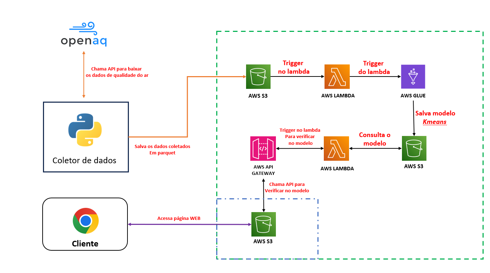

# Tech Challenge 3

## Descrição

O **Tech Challenge 3** é uma aplicação de clusterização que utiliza dados do [OpenAQ](https://openaq.org/). Este projeto foi desenvolvido com o objetivo de aplicar técnicas de clusterização em dados de volume de particulas no ar PM2.5 e PM10

## Arquitetura



## Instalação

1. Clone este repositório para a sua máquina local:
   ```bash
   git clone 
   ```

2. Instale as bibliotecas necessárias para o coletor de dados:

```
pip install -r requirements.txt

```

## Página web

A interface web criada para interagir com o projeto está na pasta [html](./html/)

## Jupyter Notebooks 

Os notebooks utilizados no AWS GLUE estão localizados em [notebooks](./notebooks/)


